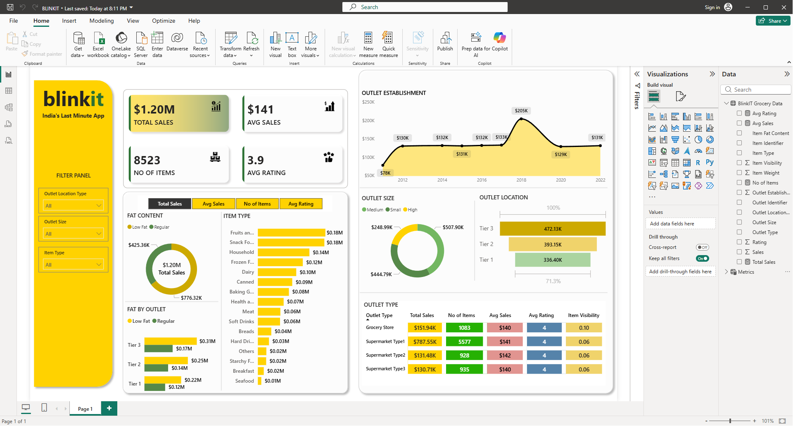

# 🛒 Blinkit Sales Dashboard | Power BI

## 📌 Overview

The Blinkit Sales Dashboard is an interactive Business Intelligence project developed using Power BI to analyze sales performance, customer ratings, product categories, and outlet trends. The dashboard provides actionable insights through dynamic visualizations, KPIs, and filters, helping users understand key business metrics and sales patterns.

---

## 📊 Dashboard Preview



---

## 🎯 Project Objectives

- Analyze overall sales performance.
- Identify top-performing product categories.
- Compare sales across different outlet sizes and locations.
- Track outlet establishment trends over time.
- Evaluate customer ratings and purchasing behavior.
- Create an interactive dashboard for data-driven decision-making.

---

## 📈 Key Performance Indicators (KPIs)

| KPI | Description |
|------|-------------|
| 💰 Total Sales | Total revenue generated |
| 📦 Number of Items Sold | Total quantity of items sold |
| ⭐ Average Rating | Average customer rating |
| 📊 Average Sales | Average sales per transaction |

---

## 🔍 Dashboard Features

### Sales Analysis
- Total Sales Overview
- Average Sales Analysis
- Sales Distribution by Category

### Product Analysis
- Sales by Item Type
- Fat Content Analysis
- Product Category Performance

### Outlet Analysis
- Sales by Outlet Size
- Sales by Outlet Location
- Sales by Outlet Type

### Trend Analysis
- Outlet Establishment Trends
- Historical Performance Analysis

### Interactive Filters
Users can filter data based on:
- Outlet Location Type
- Outlet Size
- Item Type

---

## 🛠️ Tools & Technologies Used

- Power BI
- Power Query
- DAX (Data Analysis Expressions)
- Excel / CSV Dataset
- Data Modeling

---

## 📂 Project Structure

```text
Blinkit-Sales-Dashboard/
│
├── Blinkit_Dashboard.pbix
├── blinkit_Dashboard.png
├── Dataset.xlsx
└── README.md
```

---

## 📊 Key Insights

- Identified the highest revenue-generating product categories.
- Compared sales performance across outlet sizes.
- Analyzed the impact of outlet location on sales.
- Evaluated customer ratings across different product types.
- Tracked outlet establishment growth trends.
- Examined the contribution of outlet types to total sales.

---

## 🚀 How to Use

1. Clone this repository:
   ```bash
   git clone https://github.com/Kaustubh-04/Blinkit-sales-Dashboard.git
   ```

2. Open the `.pbix` file in Power BI Desktop.

3. Refresh the dataset if required.

4. Use the slicers and filters to explore insights.

---

## 💡 Skills Demonstrated

- Data Cleaning
- Data Transformation
- Data Modeling
- DAX Measures
- Data Visualization
- Dashboard Design
- Business Intelligence Reporting
- KPI Development

---

## 📸 Dashboard Highlights

✅ Interactive Dashboard  
✅ Dynamic KPIs  
✅ Sales Trend Analysis  
✅ Product Performance Analysis  
✅ Outlet Performance Insights  
✅ Customer Rating Analysis  

---

## 🔮 Future Enhancements

- Profitability Analysis
- Sales Forecasting
- Customer Segmentation
- Inventory Analysis
- Power BI Service Deployment

---

## 👨‍💻 Author

**Kaustubh Ghodmare**

Aspiring Data Analyst | Power BI Developer | Computer Science Engineer

GitHub: https://github.com/Kaustubh-04

---

⭐ If you found this project useful, please consider giving it a star!
